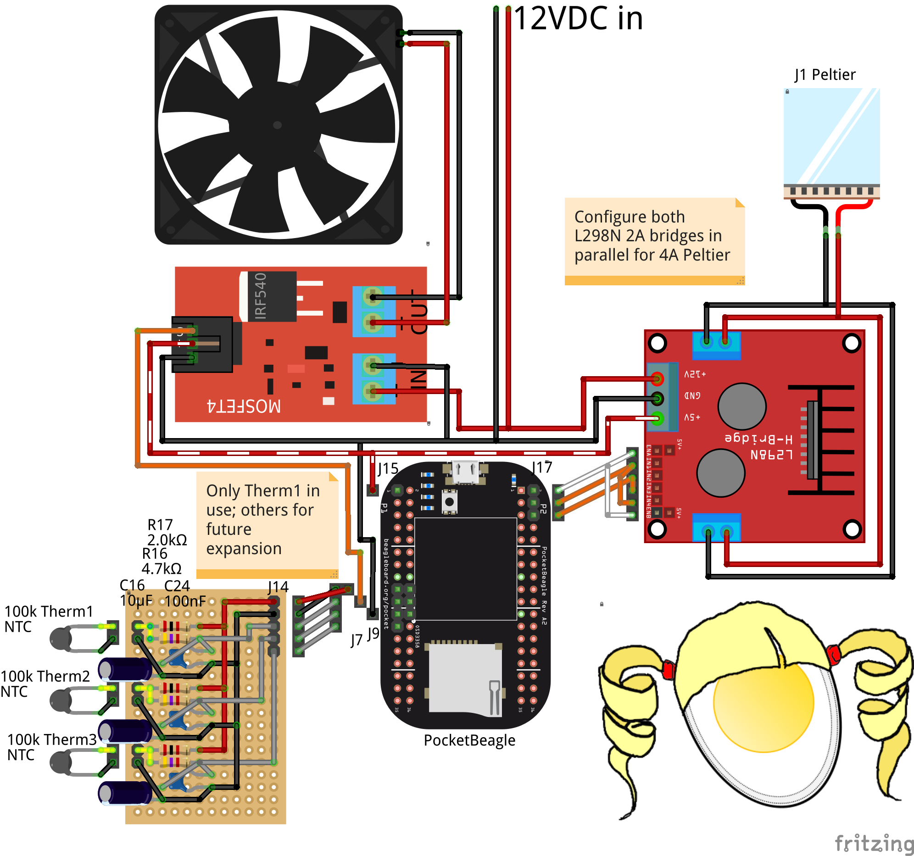

# Machinekit Goldilocks Incubator

Here are plans to build a "Goldilocks incubator":  this incubator may
be set to be not too hot, and not too cold, but just right.  It was
designed for incubating organisms that don't need a precise
temperature to thrive, as long as extremes are avoided.

It is mostly built with common components readily available from eBay,
although a small amount of soldering and a few custom cables are
required.

The controller is a PocketBeagle running Machinekit.  The current
functionality could be duplicated with an inexpensive Arduino.
However, a remote mobile phone interface with controls and logging
interface will be added in time.

# Construction

Parts list from eBay:
- "Portable fridge cooler warmer 110V," about $40
  - These can be used on car 12VDC or on 110VAC
  - The 12VDC peltier junction can switch to cool or heat
- "L298N motor driver module," about $5
  - Used to switch peltier junction polarity positive/negative/off
- "100k thermistor," about $5
  - Temperature sensor input
- "Thermagon 6100" heat-conductive pad, about $5
  - Conducts fridge temperature to thermistor
- "Mosfet Arduino module", about $8
  - Switches fan on/off
- PocketBeagle, about $25
  - The controller running Machinekit
  - Wireless network interface is a plus

Parts list from junk box:
- Hookup wire, min. 20AWG for 12V connections
- Dupont header connectors for signal wires
- Resistors, 1 ea. 4.7k and 2.0k ohm
- Capacitors, 1 ea. 100uF and 10mF
- Tools:  soldering, crimping, multimeter, screwdrivers, cutters,
  strippers, etc.



# Running

Follow the instructions at [machinekit.io][machinekit.io] to download
and install a mini-SD card image with Machinekit.

Log into the BeagleBone, clone this repository, and `cd` into the
repository directory.

Run the HAL configuration:

    ./mk-incubator.hal

Control the incubator from the command line:

    # Set incubator min, max and hysteresis params
    ./set.sh 15 30 2
    # Disable/enable the incubator without shutting down
    ./set.sh disable
    ./set.sh enable
    # Shut down the incubator
    ./set.sh shutdown

There is also a simulator configuration:

    ./incubator-sim.hal
    # Set simulated outdoor temp
    ./set.sh setsim 35

[machinekit.io]: http://machinekit.io

# Web interface

This is just beginning development and does nothing interesting yet.

```shell
# Build the Docker image
docker/qqvcp.sh build

# Build the AND demo
docker/qqvcp.sh anddemo-build

# Run the AND demo
docker/qqvcp.sh anddemo
# ...in debug mode
DEBUG=5 MSGD_OPTS=-s docker/qqvcp.sh anddemo
```


[L298_datasheet]: http://www.st.com/content/ccc/resource/technical/document/datasheet/82/cc/3f/39/0a/29/4d/f0/CD00000240.pdf/files/CD00000240.pdf/jcr:content/translations/en.CD00000240.pdf

[config-pin]: https://github.com/beagleboard/bb.org-overlays/tree/master/tools/beaglebone-universal-io
