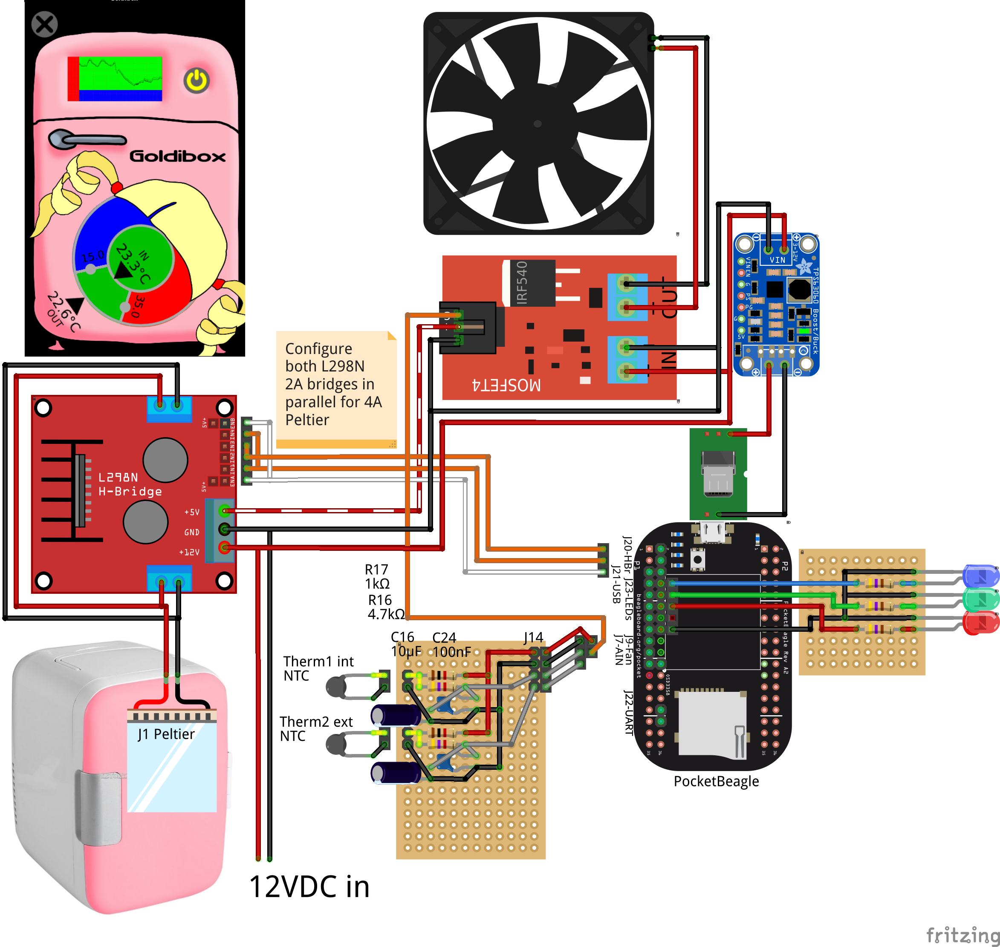

# Goldibox.  Not too hot, not too cold.

The Goldibox is an insulated box that maintains temperature using a
thermoelectric device and a controller.  Originally conceived to
incubate biological organisms that thrive best within a particular
maximum/minimum temperature range, it can both heat and cool to avoid
extremes, but still allow variability within a habitable "Goldilocks
zone":  not too hot, not too cold, but just right.

The Goldibox's smart controller exposes a remote, network-connected
graphical interface for setting temperatures, checking current state,
and viewing history through time series graphs.  Anyone may modify the
open-source control to add new features.

This is currently a **work in progress**.

## Components

The Goldibox is based on a portable fridge.  These use a [Peltier
junction][wiki-peltier], which can be switched from a cooling element
to a heating element merely by reversing the voltage.  They are also
small, light and inexpensive, and can be found on eBay for about $40;
search for "portable fridge cooler warmer 110V".

The Goldibox controller, a tiny [PocketBeagle][pocketbeagle] computer,
fits in the cramped space next to the Peltier junction fan and heat
sink.  This small computer has the analog and digital interfaces to
control the hardware, and runs Debian and the control software.  They
sell for about $25 through official distributors, and also need a $10
micro SD card for the OS, a $3 DC step-down converter to 5VDC power
from the 12VDC fridge power supply,  and a $5 [USB type A breakout
module][usb-breakout] and $10 USB WiFi adapter for networking.

The control functions come from the [Machinekit][machinekit] software
and its configuration in this repository.

The fridge is fitted with control electronics:  thermistors and
circuitry sense temperature; an H-bridge switches the Peltier junction
between cool, heat and off; a MOSFET switches the fan on and off; and
a DC-DC step-down converter provides 5VDC power for the PocketBeagle.
These are small enough to easily fit under the rear cover of the
fridge next to the power supply and Peltier junction.  The H-bridge,
MOSFET and DC power converter can be found integrated in pre-assembled
modules, and all parts are inexpensive and readily available.  Search
for "L298N motor driver module," "Mosfet Arduino module," "DC
step-down converter" and "10k thermistor" on eBay, all around $5-$8.
The sensor resistors and capacitors are inexpensive if not already in
one's junk box.  Also, a piece of Thermagon 6100 heat-conductive pad
efficiently conducts temperature from the fridge to the internal
thermistor.  The electronics are easily assembled with pre-assembled
header wires and a little soldering; heat-shrink tubing and
custom-crimped connectors improve appearance.

[wiki-peltier]: https://en.wikipedia.org/wiki/Thermoelectric_cooling
[pocketbeagle]: https://beagleboard.org/pocket
[usb-breakout]: https://github.com/zultron/fritzing-parts/tree/master/pocketbeagle-usb-type-a
[machinekit]: http://www.machinekit.io/

# Remote interface

A remote interface using Alexander Rössler's [QtQuickVCP][qqvcp] is
under development.  Here is a mock-up of the desired interface.  It is
intended to get the most important controls and readouts, the
time-series graphs, and of course the logo all on one simple,
intuitive screen.

[qqvcp]: https://github.com/qtquickvcp/QtQuickVcp

## Time series graphs

A sample time series graph with elements explained:

- **Areas:**  The maximum/minimum temperature is set by the user
  - **Red (1):**  Too hot
  - **Blue (2):**  Too cold
  - **Green (3):**  The "Goldilocks zone," just right
- **Curves:**  Internal and external temperatures
  - **Green (4):**  Internal temperature; Peltier junction off
  - **Red (5):**  Internal temperature; Pealtier junction heating
  - **Blue (not shown):**  Internal temperature; Pealtier junction
    cooling
  - **Black dashed (7):**  External temperature
- **Stats:**  Percent of time Peltier junction is...
  - **Heating (8)**
  - **Cooling (9)**

# Running

Follow the instructions at [machinekit.io][machinekit.io] to download
and install a mini-SD card image with Machinekit.

Log into the BeagleBone, clone this repository, and `cd` into the
repository directory.

On the PocketBeagle, start the Goldibox control from the command line
(load the overlay file for non-system installs):

    bin/goldibox -o

The Goldibox should now be ready for control.  Start the
[MachinekitClient][qqvcp] and open the Goldibox app.

Alternatively, run a Goldibox simulated control and GUI in a Docker
container from the command line.  Get the URL for the [latest
MachinekitClient build][mkclient-dl], then:

    # Start the container
    docker/qqvcp.sh
    # Start control in sim mode
    bin/goldibox -b sim &
    # Start GUI
    MachinekitClient &

The Goldibox may be installed to the system so that it is run at every
boot:

    sudo make install
    sudo systemctl daemon-reload
    sudo systemctl start goldibox

[machinekit.io]: http://machinekit.io
[qqvcp]: https://github.com/qtquickvcp/QtQuickVcp
[mkclient-dl]: https://bintray.com/machinekoder/MachinekitClient-Development/MachinekitClient_Development-Linux-master-x64/#files/

# Installing the PocketBeagle

See the jumble of notes in [NOTES.md](NOTES.md)

