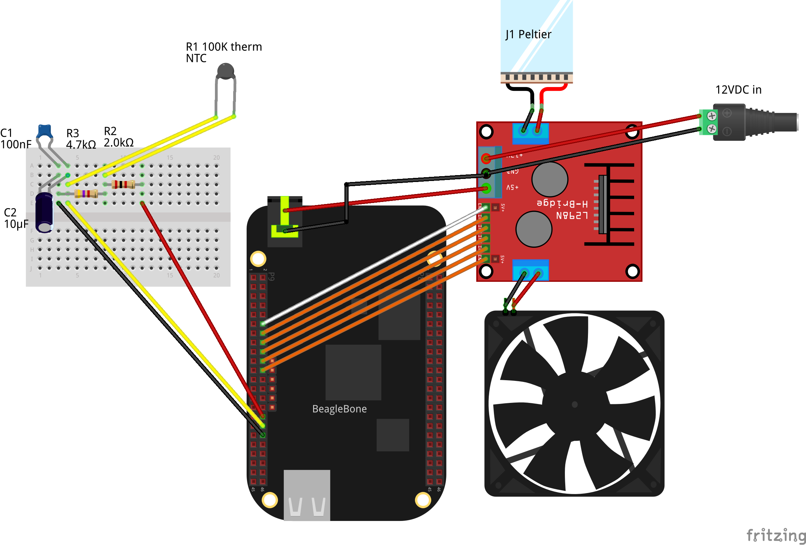

# Machinekit Goldilocks Incubator

Here are plans to build a "Goldilocks incubator":  this incubator may
be set to be not too hot, and not too cold, but just right.  It was
designed for incubating organisms that don't need a precise
temperature to thrive, as long as extremes are avoided.

It is mostly built with common components readily available from eBay,
although a small amount of soldering and a few custom cables are
required.

Parts list from eBay:
- "Portable fridge cooler warmer 110V," about $40
  - These can be used on car 12VDC or on 110VAC
  - The 12VDC peltier junction can switch to cool or heat
- "L298N motor driver module," about $5
  - Used to switch peltier junction polarity positive/negative/off
  - Used to switch fan on/off
- "100k thermistor," about $5
  - Temperature sensor input
- "Thermagon 6100" heat-conductive pad, about $5
  - Conducts fridge temperature to thermistor
- "Barrel to terminal block male adapter," about $5
  - Connects 5V BeagleBone power from L298N module power regulator

Parts list from junk box:
- Hookup wire, min. 20AWG for 12V connections
- Dupont header connectors for signal wires
- Resistors, 1 ea. 4.7k and 2.0k ohm
- Capacitors, 1 ea. 100uF and 10mF
- Tools:  soldering, crimping, multimeter, screwdrivers, cutters,
  strippers, etc.

[L298_datasheet]: http://www.st.com/content/ccc/resource/technical/document/datasheet/82/cc/3f/39/0a/29/4d/f0/CD00000240.pdf/files/CD00000240.pdf/jcr:content/translations/en.CD00000240.pdf
